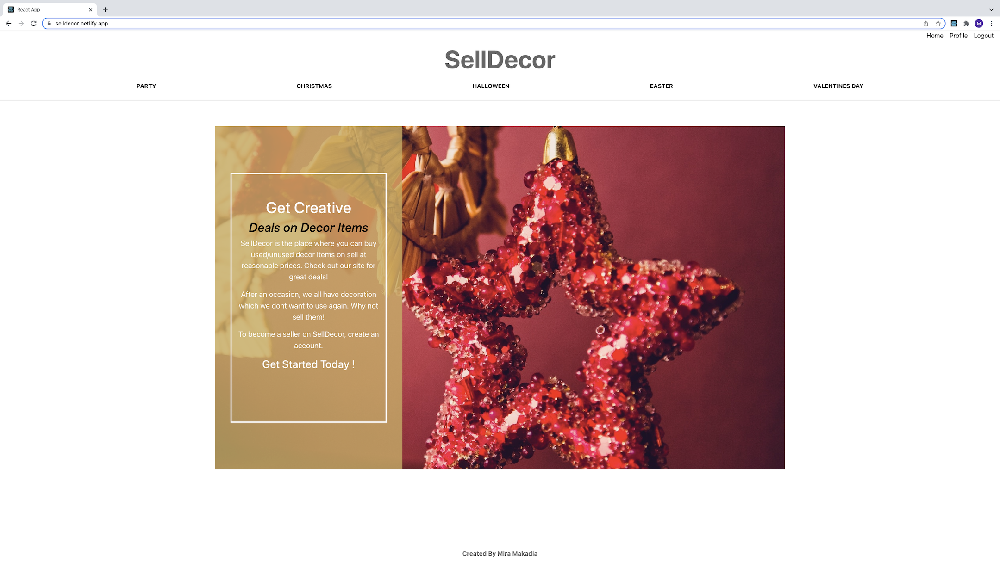
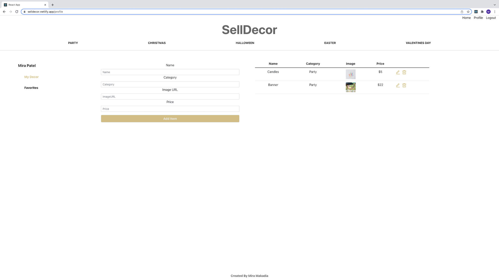
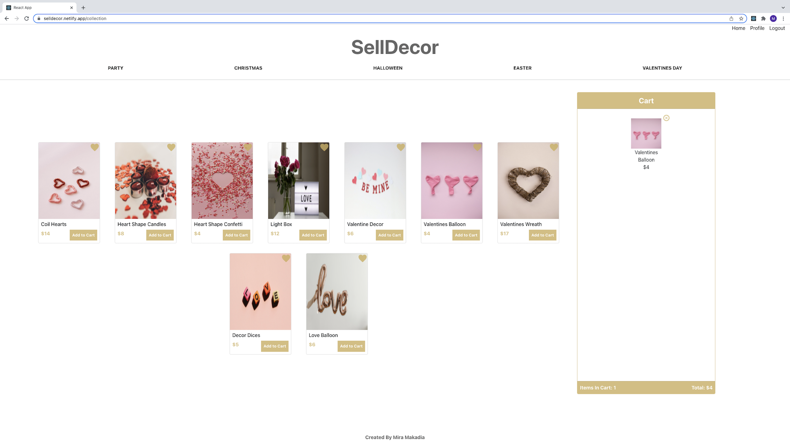

# SellDecor

This is MERN-stack application which uses data from SellDecor REST API hosted on Heroku.  SellDecor is the place where users can buy or sell used/unused decor items. After a occasion, decor items which you don't need can be sold. You can also purchase other items at reasonable price for your special occasion.

## Technologies Used

- HTML5
- CSS3
- JavaScript
- Mongoose
- Node.js
- Express
- MongoDB
- React
- Google Firebase
- React Bootstrap 

## Screenshots
### Home page

### Profile page

### Collection page

## Getting started
[Check me for project planning](https://trello.com/b/pzdGyjrB/selldecor)

[Click Here](https://selldecor.netlify.app/) to see the deployed app!

## Future Enhancements

- Add cart data to user mongoose model so that when user logs out  the information is saved and user can retrieve information at later time.
- Add CSS styles for diffent screen sizes.

 